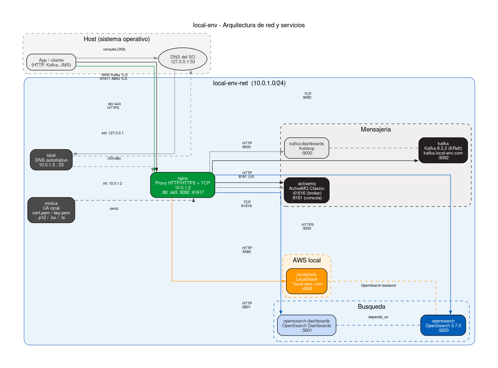

# Arquitectura de local-env

## 1. Vision general

`local-env` es un entorno Docker que reproduce en local las condiciones de conectividad de produccion: URLs con nombres de dominio reales, TLS valido (desde la perspectiva de la app) y servicios AWS emulados. El objetivo es que una aplicacion pueda conectarse a `https://opensearch.local-env.com` o publicar en `kafka.local-env.com:9092` sin cambiar ni una linea de configuracion respecto a lo que usaria en produccion.

El modelo mental es: **DNS resuelve el nombre -> nginx recibe la conexion -> nginx enruta al servicio correcto**. La app nunca habla directamente con OpenSearch, Kafka o LocalStack; siempre pasa por nginx.



---

## 2. Componentes y responsabilidades

| Componente | Imagen / tecnologia | Rol | IP / puertos expuestos |
|---|---|---|---|
| bind | BIND9 (imagen custom) | DNS autoritativo para local-env.com y local-aws.com | 10.0.1.3, host 53/udp+tcp |
| minica | imagen custom (minica + keytool) | CA local; genera certificados TLS para cada dominio | sin IP fija; contenedor init |
| nginx | nginx:latest | Punto de entrada unico: proxy HTTP/HTTPS y TCP stream | 10.0.1.2, host 80, 443, 9092, 61617 |
| dashboard | local-env/dashboard:latest | UI web de gestion del entorno (FastAPI + Vue 3) | red interna, 8000 |
| opensearch | opensearchproject/opensearch:3.7.0 | Motor de busqueda | red interna, 9200 |
| opensearch-dashboards | opensearchproject/opensearch-dashboards:3.7.0 | UI de OpenSearch | red interna, 5601 |
| localstack | localstack/localstack:stable | Emulacion de servicios AWS (S3, SQS, SES, STS, OpenSearch) | red interna, 4566; host 4566, 4510-4559 |
| activemq | apache/activemq-classic:latest | Broker de mensajeria JMS | red interna, 61616 (broker), 8161 (consola) |
| kafka | confluentinc/cp-kafka:8.2.2 | Broker de mensajeria (modo KRaft, sin Zookeeper) | red interna, 9092 |
| kafka-dashboards | obsidiandynamics/kafdrop | UI de Kafka | red interna, 9000 |

---

## 3. Red Docker

La red `local-env-net` es una red bridge con subnet `10.0.1.0/24` y gateway `10.0.1.1`. Los contenedores que necesitan ser encontrados por nombre por el resto del sistema tienen IP fija:

- **nginx** -> `10.0.1.2`: punto de entrada de todo el trafico de aplicacion. Al tener IP fija, la vista `internal` de BIND puede apuntar `*.local-env.com` y `*.local-aws.com` a esta IP de forma estatica.
- **bind** -> `10.0.1.3`: el servidor DNS. Al tener IP fija, se puede configurar como DNS del sistema operativo del host o de otros contenedores con una entrada estatica.

El rango `10.0.1.64/26` (64-127) queda reservado para que Docker asigne IPs al resto de contenedores (opensearch, localstack, activemq, kafka, etc.).

---

## 4. Capa DNS (BIND9)

BIND9 actua como servidor autoritativo para los dominios `local-env.com` y `local-aws.com`. Usa dos vistas que permiten devolver respuestas distintas segun el origen de la consulta:

| Vista | Clientes que la activan | Resolucion |
|---|---|---|
| `internal` | Cualquier IP en 10.0.1.0/24 (contenedores) excepto el gateway | `*.local-env.com` y `*.local-aws.com` -> `10.0.1.2` (nginx dentro de la red) |
| `external` | Cualquier otro cliente (el host del sistema operativo) | `*.local-env.com` y `*.local-aws.com` -> `127.0.0.1` (loopback del host, donde nginx expone sus puertos) |

Esta dualidad hace que tanto las apps que corren en el host como los contenedores de la misma red puedan usar los mismos nombres de dominio y llegar a nginx sin configuracion adicional.

**Configurar BIND como DNS del SO del host:** apuntar el DNS del sistema a `127.0.0.1` (puerto 53 que bind expone en el host) o directamente a la IP del contenedor bind si se conoce.

---

## 5. Capa TLS (minica)

`minica` es un contenedor de tipo init que actua de CA (Certificate Authority) local. Se ejecuta una vez al arrancar y luego queda en `tail -f /dev/null` manteniendo el volumen montado.

**Que produce:**

Para cada dominio detectado en `/etc/nginx/conf.d/http/*.conf` (leyendo el nombre del fichero, p.ej. `local-env.com.conf` -> dominio `local-env.com`):

- `cert.pem` y `key.pem` para `dominio` y `*.dominio` (wildcard)
- `dominio.p12` (PKCS12)
- `dominio.ks` (Java KeyStore JKS con el certificado y la CA)
- `dominio.ts` (no se genera por dominio; si se genera `ca-cert.ts`)

Para `local-aws.com` genera SANs adicionales: `*.us-east-1.local-aws.com`, `*.s3.us-east-1.local-aws.com`, `*.us-east-1.opensearch.local-aws.com`, necesarios para que el SDK de AWS y LocalStack acepten el certificado.

**Ficheros globales:**
- `ca_cert.pem`: certificado raiz de la CA local (hay que importarlo en el trust store del SO o de la JVM para que las apps confien en los certificados)
- `stores/ca-cert.ts`: truststore Java con solo la CA raiz

**Donde se guardan:** `/app/certs/` (volumen compartido con nginx en `/etc/nginx/certs/` y con el dashboard en `/certs/`, de solo lectura).

Los ficheros de `stores/` tambien se pueden descargar sin acceso al filesystem del host desde la API del dashboard (ver [seccion 9](#9-api-del-dashboard)).

---

## 6. Capa de proxy (nginx)

nginx es el unico punto de entrada. Escucha en cuatro puertos del host:

### HTTP y HTTPS (bloque `http`)

Cada fichero `.conf` en `conf.d/http/` define los virtual hosts:

| Dominio | Puerto | Backend |
|---|---|---|
| `opensearch.local-env.com` | 80, 443 | `https://opensearch:9200` |
| `opensearch-dashboards.local-env.com` | 80, 443 | `http://opensearch-dashboards:5601` |
| `activemq-dashboards.local-env.com` | 80, 443 | `http://activemq:8161` |
| `kafka-dashboards.local-env.com` | 80, 443 | `http://kafka-dashboards:9000` |
| `*.local-aws.com` | 80, 443 | `http://localstack:4566` |

El certificado TLS usado en cada bloque `ssl` es el generado por minica para el dominio raiz (p.ej. el wildcard `*.local-env.com` sirve para todos los subdominios).

### TCP stream (bloque `stream`)

Los brokers no hablan HTTP; nginx los expone como proxies TCP con terminacion TLS:

| Puerto host | Protocolo | Backend |
|---|---|---|
| 9092 | SSL -> TCP | `kafka:9092` |
| 61617 | SSL -> TCP | `activemq:61616` |

### Modelo de extension

Los directorios `conf.d/http/` y `conf.d/stream/` tienen `.gitignore` que excluyen ficheros adicionales. Esto permite que cada proyecto que use local-env anada sus propios `.conf` sin tocar el repositorio base y sin que esos ficheros aparezcan en git.

---

## 7. Emulacion AWS (LocalStack)

LocalStack expone todos los servicios AWS en el puerto `4566`. El acceso se realiza a traves de nginx usando el dominio `local-aws.com`:

- La variable `LOCALSTACK_HOST=local-aws.com` configura LocalStack para que sepa que dominio usar en las URLs que genera
- `OPENSEARCH_CUSTOM_BACKEND` apunta a OpenSearch real (opensearch:9200) para que LocalStack lo use como backend de dominios OpenSearch
- nginx proxea `*.local-aws.com` -> `http://localstack:4566`

Esto permite usar el SDK de AWS con `endpoint_url=https://s3.us-east-1.local-aws.com` y obtener TLS valido (certificado de minica).

Los endpoints de servicio disponibles son: `s3.local-aws.com`, `sqs.local-aws.com`, `ses.local-aws.com`, `sts.local-aws.com`, `opensearch.local-aws.com`. El estado de los servicios activos se muestra en tiempo real en el dashboard (`https://dashboard.local-env.com`).

**Recursos creados automaticamente al arrancar** (por `init.sh` en `ready.d/`):

- Rol IAM `BasicRole` con politica STS basica
- Dominio OpenSearch `test-opensearch`
- Bucket S3 `test-bucket`
- Bucket S3 `sqs-bucket`
- Colas SQS FIFO: `test-sqs-queue-01.fifo`, `test-sqs-queue-02.fifo`
- Identidad SES verificada: `no-reply@local-env.com`

El directorio `init/ready.d/` tambien tiene `.gitignore`, lo que permite que cada proyecto anada sus propios scripts de inicializacion sin afectar al repositorio base.

---

## 8. Modelo de extension

`local-env` esta disenado para ser la base sobre la que cada proyecto anade lo que necesita, sin tocar los ficheros del repositorio:

| Punto de extension | Ubicacion | Que permite anadir |
|---|---|---|
| Configuraciones HTTP nginx | `services/nginx/etc/nginx/conf.d/http/` | Nuevos dominios y proxies HTTP/HTTPS |
| Configuraciones stream nginx | `services/nginx/etc/nginx/conf.d/stream/` | Nuevos proxies TCP (brokers, bases de datos TCP) |
| Scripts init LocalStack | `services/localstack/init/ready.d/` | Recursos AWS adicionales al arrancar |

Todos estos directorios tienen `.gitignore` configurado para ignorar los ficheros que cada proyecto anade, de modo que los cambios del proyecto no contaminan el repo base de local-env.

---

## 9. API del dashboard

El backend del dashboard (FastAPI) expone una API REST bajo `/api/*`, documentada automaticamente en formato OpenAPI/Swagger:

| Recurso | URL |
|---|---|
| Swagger UI (interactivo) | `https://dashboard.local-env.com/docs` |
| Redoc (solo lectura) | `https://dashboard.local-env.com/redoc` |
| Spec OpenAPI (JSON) | `https://dashboard.local-env.com/openapi.json` |

Una copia estatica del spec (para referencia offline o para importar en Postman/Insomnia) se guarda en [`docs/api/openapi.json`](api/openapi.json). No se regenera automaticamente: si se anaden o cambian endpoints en `services/dashboard/backend/main.py`, hay que volcarla de nuevo con:

```bash
curl -s https://dashboard.local-env.com/openapi.json | python3 -m json.tool > docs/api/openapi.json
```

Los endpoints estan agrupados por tags: `servicios` (arrancar/parar/estado), `apps` (apps externas detectadas), `certificados` (certificados TLS y descarga de keystores/truststores), `nginx` (recarga de config), `minica` (regenerar certificados), `logs` (streaming SSE) y `aws` (salud de LocalStack).

### Vista "API" del propio dashboard

Ademas de las rutas anteriores (pensadas para consumo externo/programatico), el frontend Vue tiene una pestaña **API** que embebe Swagger UI (vía `swagger-ui-dist`, con carga diferida para no engordar el bundle principal) apuntando a `/openapi.json`. Es la forma recomendada de explorar la API desde dentro del propio dashboard, con el mismo look&feel que el resto de la UI.

### Deteccion de Swagger en apps externas

La vista **Apps** (deteccion via `.conf` de nginx, ver [`docs/integration.md`, seccion 9](integration.md#9-visibilidad-en-el-dashboard-de-local-env)) tiene un boton "API" por cada servicio detectado. Al pulsarlo, el backend prueba, a traves de nginx y por el dominio de la app, las rutas habituales donde suelen vivir los specs OpenAPI/Swagger:

`/openapi.json`, `/v3/api-docs` (Springdoc), `/swagger.json`, `/swagger/v1/swagger.json` (Swashbuckle/.NET), `/api-docs`.

Si alguna responde con un JSON valido (`openapi` o `swagger` como clave de nivel superior), se renderiza en un modal con Swagger UI. Si ninguna responde, se muestra un aviso — no es un error, simplemente esa app no expone (o no expone en una ruta conocida) su documentacion OpenAPI.

**Como llega el backend a la app:** conecta directamente a nginx por su IP fija (`10.0.1.2`) pero fijando el SNI/TLS y el header `Host` al dominio de la app (`GET /api/apps/{domain}/openapi` en `services/dashboard/backend/main.py`). Esto evita depender de que `*.local-env.com` resuelva correctamente por DNS desde dentro del contenedor del dashboard (la vista `internal` de BIND solo se activa de forma fiable para clientes que consultan a bind directamente, no via el resolver de Docker) — ver [seccion 4](#4-capa-dns-bind9).

Para que tu app aparezca aqui, basta con exponer su spec OpenAPI en una de las rutas anteriores; no hace falta ninguna configuracion adicional en local-env.
